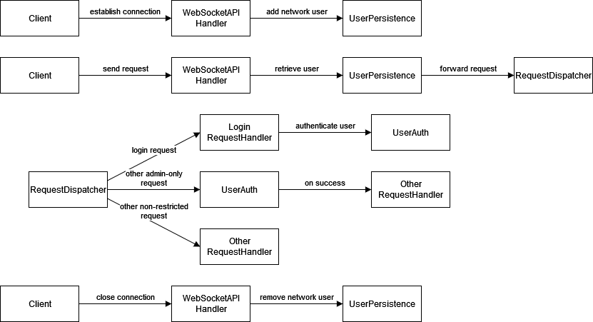

## Security Design

Current design is loosely based on Spring Security. Spring Security only 
supports HTTP, and WebSocket w/ STOMP. 

:memo: It is possible to adapt our application to use HTTP, since 
WebSocket does require an initial HTTP handshake. However, it will 
require considerable research.

But no no no.

## Security flow

[draw.io (right click, save)](securityflow.drawio)

