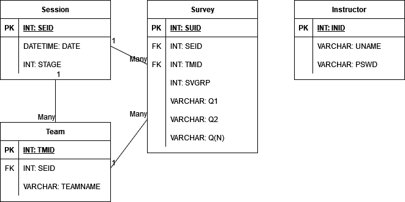

## Overview

[draw.io (right click, save)](/downloads/DB.drawio)

### Session

| Type | Name | Comments |
| ---  | ---  | ---      |
| INT, PK  | SEID | Session UUID. |
| DATETIME | DATE | Session creation date. For auto deleting past sessions. |
| INT      | STAGE | Session progress stage (e.g. 1st poll, 2nd poll). |

### Team

Individual students are not registered. Only teams.

| Type | Name | Comments |
| ---  | ---  | ---      |
| INT, PK      | TMID  | |
| INT, FK      | SEID  | Session UUID in which the team belongs to. |
| VARCHAR(255) | TNAME | Team's name (Marshall room number). Must be unique in a session. Password not required. |

### Admin/Instructor

Admins and instructors share a table. Both have equal priviledges to create 
and administer a session. Admins and instructors have the ability to join any 
session. 

| Type | Name | Comments |
| ---  | ---  | ---      |
| INT, PK      | INID  | |
| VARCHAR(255) | UNAME | |
| VARCHAR(255) | PSWD  | Instructors are required to have a password. |

### Survey

Stores only survey answers. Survey questions are pre-determined and 
delivered static to the teams. We do not anticipate any change to the 
survey questions.

Note: A single MySQL row may store at most 65,535 bytes. The database 
is created with UTF8MB4, reducing the maximum to 16,384 bytes.

| Type | Name | Comments |
| ---  | ---  | ---      |
| INT, PK       | SQID   | |
| INT, FK       | SEID   | Session UUID in which the team belongs to. |
| INT, FK       | TMID   | Team who completed the survey. |
| INT           | SVGRP  | 1st survey, or 2nd survey. |
| VARCHAR(1023) | Q1     | Limit answers to 1023 characters. |
| VARCHAR(1023) | Q2     | |
| VARCHAR(1023) | Q3     | |
| VARCHAR(1023) | Q4     | |
| VARCHAR(1023) | Q5     | |
