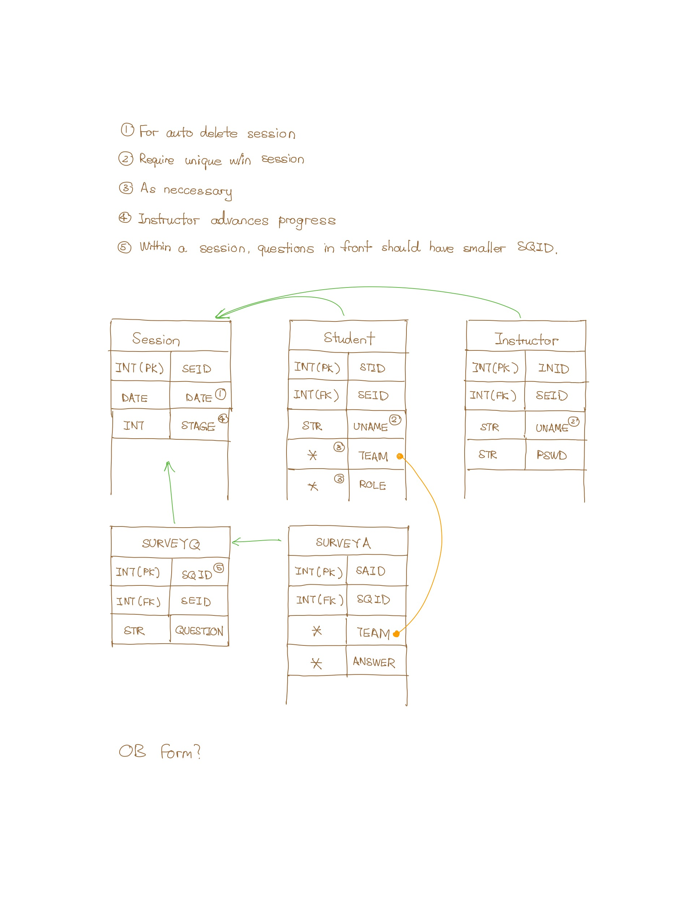

## Overview

### Session

| Type | Name | Comments |
| ---  | ---  | ---      |
| INT, PK  | SEID         | Session UUID. |
| DATETIME | CREATE_DATE  | Session creation date. For auto deleting past sessions. |
| INT      | STAGE        | Session progress stage (e.g. 1st poll, 2nd poll). |

### Student

| Type | Name | Comments |
| ---  | ---  | ---      |
| INT, PK | STID  | |
| INT, FK | SEID  | Session UUID in which the student belongs to. |
| STR     | UNAME | Student's username. Must be unique in a session if password is not required. |
| ?[^1]   | TEAM  | Student's team. |
| ?       | ROLE  | Student's role. |

### Instructor

| Type | Name | Comments |
| ---  | ---  | ---      |
| INT, PK | INID  | |
| INT, FK | SEID  | |
| STR     | UNAME | |
| STR     | PSWD  | Instructors are required to have a password. |

### Survey Questions

Survey questions and survey answers are stored in two separate tables. 
One-to-many relation. Support for MCQ, Short Answers, etc. can be added 
in the future.

| Type | Name | Comments |
| ---  | ---  | ---      |
| INT, PK | SQID  | |
| INT, FK | SEID  | |
| STR     | QUESTION | |

### Survey Answers

| Type | Name | Comments |
| ---  | ---  | ---      |
| INT, PK | SAID   | |
| INT, FK | SQID   | |
| ?       | TEAM   | Each team submits one survey. |
| ?       | ANSWER | Team's answer to one question in the survey. |

### Admin

The admin table is not listed. Will be identical to the `Instructor` table, 
except that admins are not associated with sessions.

[^1]: The type has not been decided.
