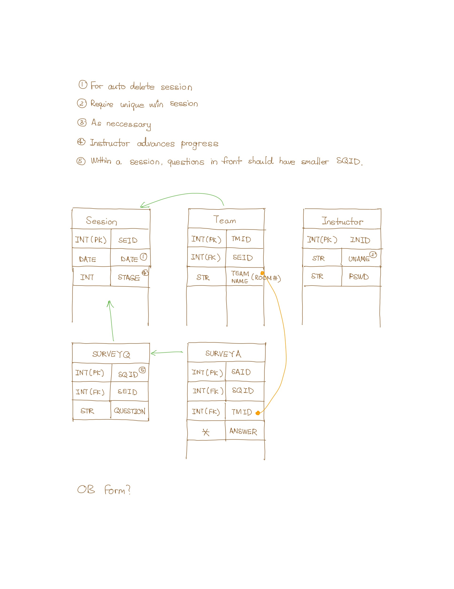

## Overview

Version 0.3

### Session

| Type | Name | Comments |
| ---  | ---  | ---      |
| INT, PK  | SEID         | Session UUID. |
| DATETIME | CREATE_DATE  | Session creation date. For auto deleting past sessions. |
| INT      | STAGE        | Session progress stage (e.g. 1st poll, 2nd poll). |

### Team

Individual students are not registered. Only teams.

| Type | Name | Comments |
| ---  | ---  | ---      |
| INT, PK | TMID  | |
| INT, FK | SEID  | Session UUID in which the team belongs to. |
| STR     | TNAME | Team's name (Marshall room number). Must be unique in a session. Password not required. |

### Admin/Instructor

Admins and instructors share a table. Both have equal priviledges to create 
and administer a session. Admins and instructors have the ability to join any 
session. 

| Type | Name | Comments |
| ---  | ---  | ---      |
| INT, PK | INID  | |
| STR     | UNAME | |
| STR     | PSWD  | Instructors are required to have a password. |

### Survey Questions

Survey questions and survey answers are stored in two separate tables. 
One-to-many relation. Support for MCQ, Short Answers, etc. can be added 
in the future.

| Type | Name | Comments |
| ---  | ---  | ---      |
| INT, PK | SQID  | |
| INT, FK | SEID  | |
| STR     | QUESTION | |

### Survey Answers

| Type | Name | Comments |
| ---  | ---  | ---      |
| INT, PK | SAID   | |
| INT, FK | SQID   | |
| INT, FK | TMID   | Each team submits one survey. |
| ?[^1]   | ANSWER | Team's answer to one question in the survey. |

### Admin

The admin table is not listed. Will be identical to the `Instructor` table, 
except that admins are not associated with sessions.

[^1]: The type has not been decided.
