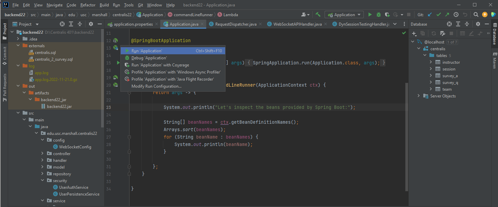

## Local Testing

### Backend

Required:

- MySQL v5.0.
- IntelliJ IDE.
- Java 11, or later.

Setup database:

1. Clone backend repository from Github.
2. Start MySQL.
3. Import testing database from `externals/centralis_2_survey.sql`.

Setup server:

1. Open folder with IntelliJ.
2. IntelliJ automatically downloads maven dependencies according to `pom.xml`.
3. Navigate to `src/main/resources/application.properties`.
4. Change settings. In particular:
    - `spring.datasource.url` if you have modified SQL ports, or used a different schema name.
    - `spring.datasource.username/password`
    - `server.port` to deploy server on a different port, default `localhost:8080`

Run server:

1. Open folder with IntelliJ.
2. Navigate to `src/main/java/edu.usc.marshall.centrallis22.Application`.
3. Click on `Run 'Application'`.

### Frontend

Required:

- Node.js v12, or later.
  - Tested on v12.22.12 and v18.12.1.
  - Including bundled resources, i.e. npm.

Setup environment:

1. Clone frontend repository from Github.
2. Open terminal and navigate to folder.
3. Use `npm i` to install dependencies.
4. Change socket connection uri at `config/socket.js`.
5. Change CSV download uri at `pages/session-results.js`.

Run:

1. Start server. Wait for server to be ready.
2. Use `npm run dev` to start NextJS app.
3. The default uri for the application is at `localhost:3000`.

## Deployment

Placeholder: Requires instruction for server.
In particular, how to import SQL files and set up ngix? and SSL for HTTPs and WebSocket.
